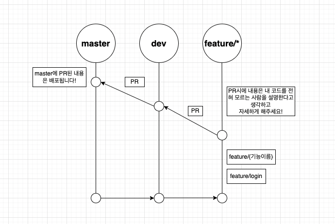

# Kunis!

url을 간편하게 관리해보세요!!!

## commit comvention

https://www.conventionalcommits.org/en/v1.0.0/

해당 페이지와 약간 변형한 Angular의 commit convention을 따릅니다.

- chore : 외부 dependency나 config들을 수정할 때 사용합니다. (example scopes: gulp, broccoli, npm)
- docs: 문서 내용을 갱신할 때 사용합니다.
- feat: 이 커밋으로 새로운 feature가 안정적으로 추가 될 때 사용합니다.
- fix: 버그 픽스 시에 사용합니다.
- refactor: 버그가 아니고, 코드의 행동도 그대로지만, 로직의 내용이 바뀌었을 때, 사용합니다.
- style: 로직에 관여하지 않는 모든 코드 수정할 때 사용합니다.
- test: 테스트를 추가, 수정, 삭제시에 사용합니다.

# Git branch 전략

